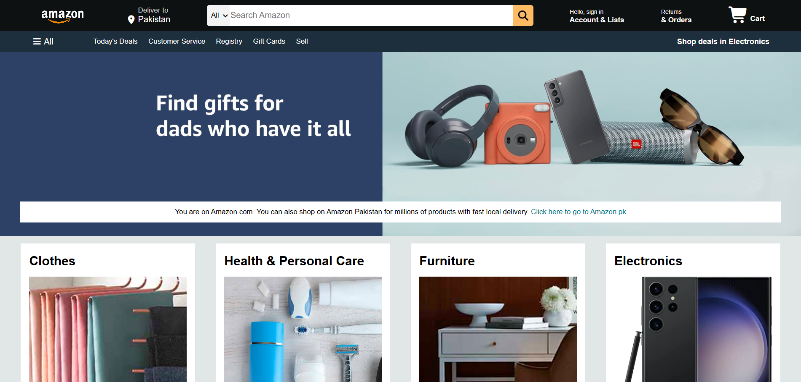

# 📦 Amazon Clone – Static Homepage (HTML & CSS)

A complete front-end clone of the **Amazon.com** homepage built with **pure HTML5 and CSS3**. No JavaScript, no frameworks – just clean, semantic code and modern CSS layout techniques.

🔗 **Live Preview:** (https://cloneamazon245.netlify.app/)  
📁 **Repository:** (https://github.com/anasjaveddev/Amazon-Clone)

---

## 🖼️ Project Screenshot

  

---

## ✨ Features

- Fully responsive navigation bar (logo, address, search, sign‑in, returns, cart)
- Search bar with category dropdown and hover effect
- Multi‑link panel (Today’s Deals, Customer Service, etc.)
- Hero section with background image and call‑to‑action message
- Product grid – 8 different categories (Clothes, Electronics, Pet Care, Toys, etc.)
- Hover effects on interactive elements (borders, search bar)
- Four‑column footer with multiple link sections + copyright panel
- Uses **Font Awesome 7** for all icons

---

## 🛠️ Technologies Used

| Technology | Purpose |
|------------|---------|
| HTML | Page structure |
| CSS | Styling, layout, hover effects |
| Flexbox | Aligning navbar, product grid, footer |
| Font Awesome | Icons (cart, location, search, bars) |

---

## 🚀 How to Run Locally

1. **Clone this repository**  
   `git clone [https://github.com/anasjaveddev/Amazon-Clone.git]

2. **Open the folder** and double‑click `index.html` – it will open in your default browser.

3. No build step, no server needed – it’s pure static HTML/CSS.

---

## 🧠 What I Learned

- Building complex layouts using **CSS Flexbox** (navbar alignment, product grid)
- Using `background-image: cover` for hero section and product boxes
- Styling hover states for interactive elements
- Structuring a multi‑level footer with `<ul>` lists
- Managing relative image paths without breaking the layout

---

## 🔮 Future Improvements (Ideas)

- Add media queries for full mobile responsiveness
- Convert the static grid into dynamic product cards with JavaScript
- Create additional pages (product detail, cart, checkout)
- Add a working search filter using JS

---

## 📄 License

This project is for **educational purposes only**. All design credits go to Amazon.com. No copyright infringement intended.

---

## 👤 Author

**Anas Javed**  
- GitHub: [anasjaveddev](https://github.com/anasjaveddev)  
- LinkedIn: [anasjaveddev](https://www.linkedin.com/in/anasjaveddev/)

---

⭐ **If you like this project, please give it a star on GitHub!**
